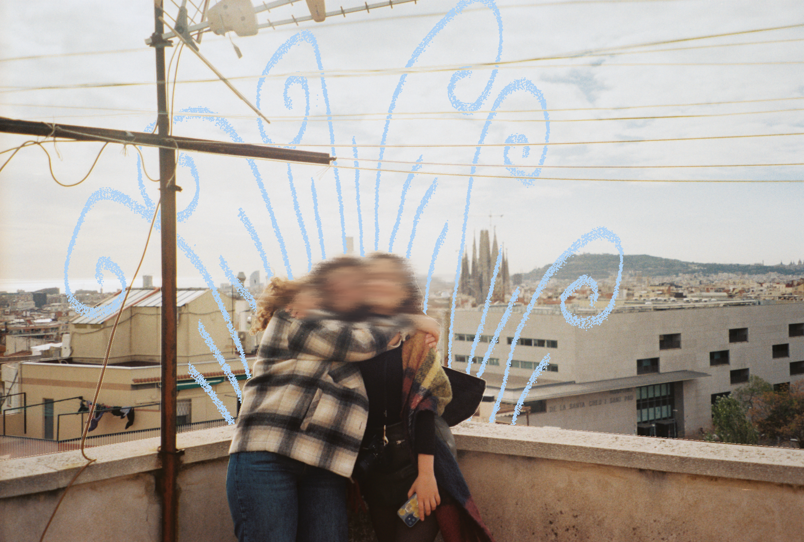
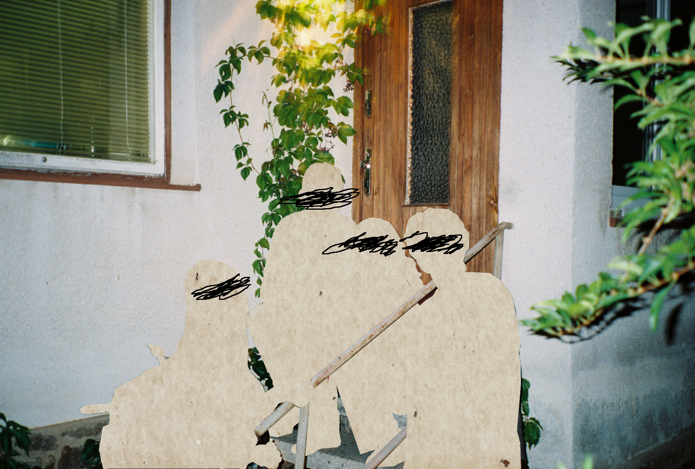

I am extremely new to photography and especially film photography, but I've discovered I 
really enjoy messing around with my photos in gimp and so here are some of my favourite
photos I've made! 

As you can see, my photos have always some sort of censor of people in the photos.
This is because after I had read "Your face belongs to us" by Kashmir Hill I felt
inspired to make my photography a little more private (although I have no real idea about 
how effective the censoring really is). This is why I now always censor people in some way
before publishing photos online :) 
